# Dollar-Quote Desync: captures the heart of it

[](https://creativecommons.org/licenses/by/4.0/)

<p align="center">
  
</p>

**Read the paper:** https://jrbusiness.github.io/Dollar-Quote-Desync/

A blind SQL injection technique that uses PostgreSQL dollar-quoting (`$_$...$_$`)
to slip past an application-level regex sanitizer, injects a scalar subquery
through an unquoted column-name position in a dynamic `EXECUTE` statement, and
extracts data one character at a time through a boolean oracle, all with zero
prior knowledge of the database schema.

## Scope

This is an **application-level sanitizer evasion, not a WAF bypass**. When the same
payloads were replayed through a default OWASP Core Rule Set 4.25.0 deployment,
every one was detected and blocked. The technique matters against custom,
hand-rolled input filters and apps with no WAF (or a tuned-down one), which is a
large class of legacy and internal PostgreSQL systems. Full validation tables are
in Section 7 of the paper.

## Contents

| File | What it is |
|------|------------|
| `index.html` | The full paper as a web page (this is what GitHub Pages serves) |
| `attack_chain.bpmn` | The attack chain as a BPMN diagram |
| `diagram-animated.svg` | Architecture / attack-flow graphic |

## Publishing this page

This repo is set up for GitHub Pages with no build step.

1. Push these files to a repo named `dollar-quote-sqli` under the `jrbusiness` account.
2. **Settings → Pages → Build and deployment → Source: Deploy from a branch → `main` / root**.
3. The page goes live at https://jrbusiness.github.io/Dollar-Quote-Desync/.

If you rename the repo or use a different account, update the two `canonical` /
`og:url` URLs at the top of `index.html` to match.

## Citation

```
Jerry Luong. "Dollar-Quote Bypass: A Blind SQL Injection Technique Against
Regex-Sanitized Dynamic PL/pgSQL." Independent research, May 2026.
https://jrbusiness.github.io/Dollar-Quote-Desync/
```

## Ethics

All experiments ran in an isolated lab. The vulnerable function, the schema, and
every extracted credential were synthetic and made only for this research. No
production system, third-party service, or real user data was involved. The
technique targets a developer coding mistake, not a flaw in PostgreSQL itself.
Use these payloads only against systems you own or are explicitly authorized to
test.

## License

[Creative Commons Attribution 4.0 International (CC BY 4.0)](LICENSE). Share and
adapt freely with attribution.
